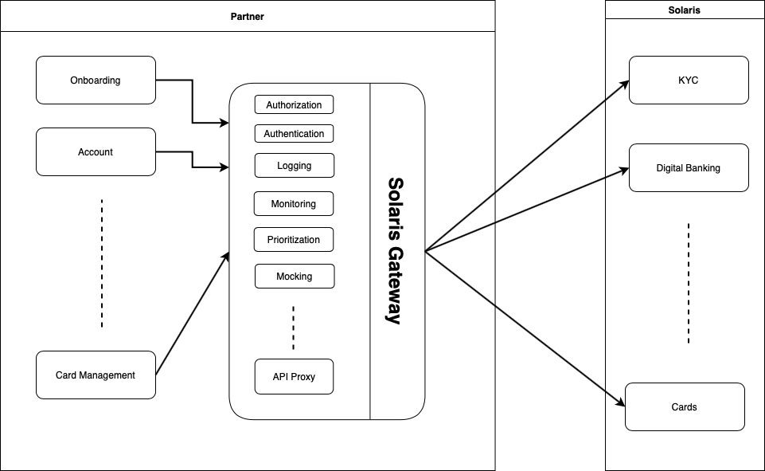
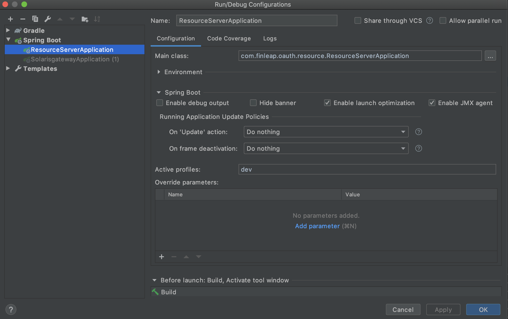

# solaris-gateway 

Solaris Gateway is an Microservice Abstraction Layer (also known as an API Gateway or API Middleware) that aims to achieve be secure, fast and scalable.

# Why solaris-gateway?

1. It provides **security improvemets** by handling bank API credentials only by the gateway, abstracted from the rest of the system, making it governance easier.
2. It provides **observability** by seperating bank API calls entirely from the rest of the system, making them easier to trace, observe and debug (in sandbox env).  
3. It is **fault-tolerant** since it would block any misbehaving and exceeding module/service whereas without the gateway Solaris Bank would be blocking the whole system.
4. It brings **development efficieny** for its users since bank API could be mocked, module by module, making testing and development much efficient with also enabling dev teams to pinpoint errors much faster.

# Getting Started

## Configuring the project

For solaris-gateway to work we need following:

* A `oauth provider endpoint`, which generates the token for the gateway to use when sending requests - for production this would be `https://api.solarisbank.de/oauth/token`
* A `service endpoint`, which the gateway would send its requests to - for production this would be `https://api.solarisbank.de`

#### Test Configuration

For testing purposes we use the following:

* [CloudFoundry UAA](https://github.com/cloudfoundry/uaa) as our oauth provider

The UAA could be run with following command in the root directory of the project:

`docker run --detach --publish 8080:8080 --mount type=bind,source=${PWD}/uaa/uaa.yml,target=/uaa.yml --env CLOUDFOUNDRY_CONFIG_PATH= --env spring_profiles=default,hsqldb cfidentity/uaa:latest`

* A custom [resource-server](resource-server) as our service endpoint

Simply run the resource-server using your IDE or using the following command, active profie should be set to `dev`:

`./gradlew bootJar`

Now we could successfully run the gateway. After it has been running successfully we could test if its working by:

`curl http://localhost:8090/solaris/uaa/user -v`

#### Running with Docker

* Gateway docker image could be build using the following command:

`docker build -f gateway/Dockerfile -t sbg:$TAG ./gateway`

* After building the image it could be run using the following command:

`docker run sbg:$TAG`

>> Please see [Dockerfile](gateway/Dockerfile) 
>> of the image for furhter build args information

# CI/CD Pipeline

The CI/CD pipeline consists of two stages:

* Build

For build stage, the runner creates jars of gateway and resource-server and uploads them as artifacts.

* Test

For test stage, the runner collects the jars as artifacts and uses them in docker builds in a docker-compose job which creates the following containers:

* gateway: the solaris-gateway itself
* resouce-server: the custom resource server
* uaa: oauth provider
* test-runner: integration tests runner

If `test-runner` container exits with exit code 0 the job succeeds else it fails.

