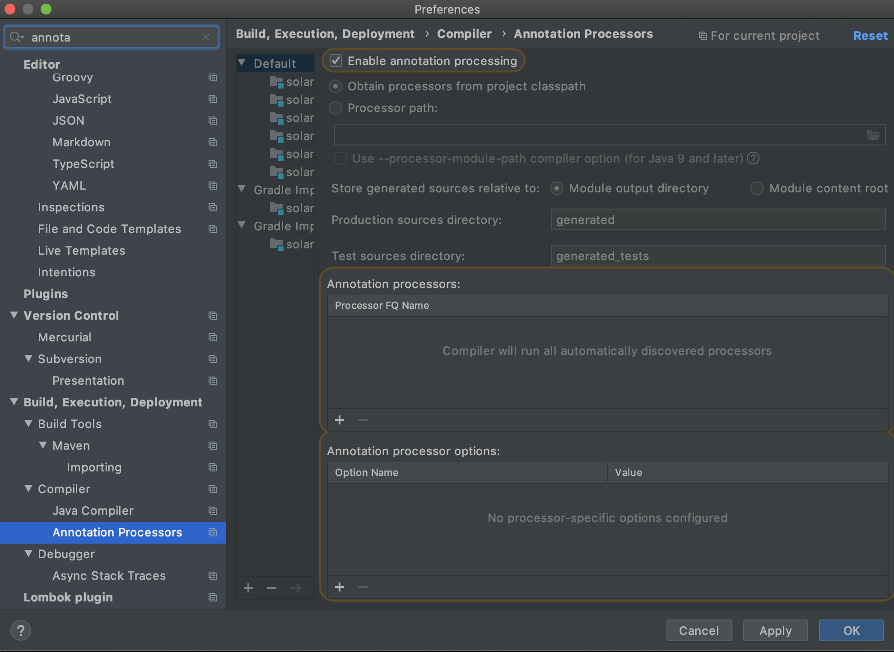

# Setting up the project using IntelliJ IDE

* `Import an existing project`

&nbsp;

* `Select Gradle as the model`

&nbsp;

* `Enable annotation processing from preferences`

&nbsp;

>> Please note that the plugins required would be asked by your IDE
>> Install them in order to run the project successfully.